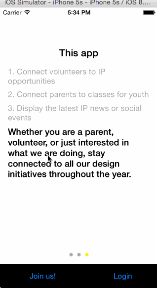

# Inneract app

## About Inneract
*  Who we are: 
  * Our mission is to increase underserved students’ access to design, through free design education, resources and new career opportunities. We believe that by surfacing pathways to the field of design and providing professional mentorship, we can boost student success, ultimately leading to an increase in diversity in design and technology. To achieve this, we engage practicing designers and other professionals to teach students about their respective disciplines. 
* We need an app to…
  * Allow our team to communicate with volunteers, parents and the gener lnneract Project
* Why this app will make a meaningful impact for us: 
  * An app would drastically simplify communication directly from our organization to our stakeholders. It would strengthen and increase our network and helps our team work more efficiently by providing a simple solution to managing interested volunteers and parents. 
* App Audience: 
   * Volunteers 
   * Parents 
* App Main Functions (in order of priority): 
   * Connect volunteers to teaching opportunities   
   * Connect parents to current/future classes for youth 
   * Display the latest IP news or social events 
   * Signup forms (classes and volunteer opportunities) 
   * Search 
   * Online payment
   
## Group Milestones
- [x] __Milestone 1 (due March 4):  Wireframes complete.__  
    These don't have to be visually polished, but they have to be "use case" complete. They should cover new user and existing user states. Don't use lorem ipsum text, it should be detailed enough to derive the app schema based on the wireframes.
- [x] __Milestone 2: (due March 11): Basic functionality complete.__
   Models implemented, backed by Parse. Can achieve the use cases. May be visually simple using stock controls and navigation.
- [x] __Milestone 3: (due March 18): Iteration sprint.__
   Start adding visual polish, augment and basic user stories with additional features.
- [ ] __Milestone 4: (due March 25): Polish sprint.__
   Add final visual polish, add any bells and whistles (custom transitions, WatchKit integration, Push notification, etc).

### Walkthrough

GIF created with [LiceCap](http://www.cockos.com/licecap/).

### Main Features
- [x] people list, profile details, editing profile
- [x] login/out, join, create account, login with facebook
- [x] feeds, feeds details, search, share and bookmark
- [x] form/payments (deferred as initial design is not mobile friendly (thinking of leveraging typeform)

### scenarios:

- [x] User can sign up and creates an account​ 
- [x] User can log in with IP login
  - [x] and go to feeds page (ip news feeds) upon success​
- [x] User can log in with FB
  - [x] and go to feeds page (ip news feeds) upon success​ (Syed)
- [x]  User can browse "IpNews" "feeds". Click to show details view with media (video, text, images​, buttons​)
  - [x] media  (Manu). Try with: https://vimeo.com/109561086 and https://vimeo.com/109933873
  - [ ] photo gallery support (manu)
  - [x] support for highlighted feed (different cell) (Manu). Will need paging controller where all highlighted feed are on top. See specs sheet for details.
  - [x] Need optional support for list of videos/articles within details view
  - [x] need support for RSVP (with link to EventBrite for instance)badge
- [x] User can search feeds/volunteer/classes/profiles
  - [x] support for "no matching feed found" (different cell) (Manu)
  - [ ] support for global search (on all fields, not only title) (Manu)
- [x] User, typically a volunteer, can browse "Volunteer" news from "feeds" 
  - [x] User can click to show details view, 
  - [x] User can apply after filling a form​(Jim)
- [x] User, typically a parent, can browse "Class" news from "feeds". 
  - [x] User can click to show details view, 
  - [x] User can apply after filling a form (Jim)
  - [x] User can pay (stripe/paypal SDK) (Syed)
- [x] class, volunteer feeds can be shared 
- [x]  class, volunteer feeds can be bookmarked. 
- [x] User can view her profile, and log out​ 
  - [x] finish edit profile (combo box etc..) (Syed)
  - [x] user can get see her activities (Need to ask Maurice: Manu)
- [x] User can browse people list, click to view details (same as profile but non editable)​
- [x] notifications: user get notified when a new feed is added, or a user grant a badge to her.

### Bugs
- [x] when no user image, it seems to be reloaded from other cells -> may beed a default image (Jim)
- [ ] global search (Manu)
- [x] support for user "badge" (ex: gold/silver/bronze user) (Jim)
- [x] see spec sheet, no badge but ability to give points. Based on number of points the border of the profile will change color.
- [x] use official colors/icons/rendering from Inneract (All)
- [x] need real bookmark and share image, change state when clicked, and make it larger (button 40x40) (Syed)
- [x] need real image for tab bar (Jim)
- [x] filter existing data for volunteer and classes (do not make again a network call) (Jim)
- [x] do not hide view when loading data, wheel at the top (Syed)

Credits
---------
* [Facebook API](https://developers.facebook.com/)
* [Parse API] (https://www.parse.com/docs/ios_guide)
* [AFNetworking](https://github.com/AFNetworking/AFNetworking)
* [SVProgressHUD](https://github.com/TransitApp/SVProgressHUD)
* [Rest2Mobile](https://github.com/magnetsystems/Rest2Mobile)

## Q&A
- What are the target devices?
   for the moment, app is for iPhone only
- Where are the assets?
   Go to google docs to find assets or dropbox link provided by Maurice. Must eventually import them in the app.
- Which apps should this app be benchmarked against?
   - For News feed: Facebook Paper app, Yahoo News digest, Tumblr
   - For Form: TypeForm
   - For payment: Paypal
-  Where can we access the back-end data
   - Back-end is hosted on Parse, including some assets such as the profile images, go to: https://www.parse.com/apps/ipios
   - Other media: video, photos gallery will be located on some CDNs
   - Full profile, articles will be available on the web sites

  

